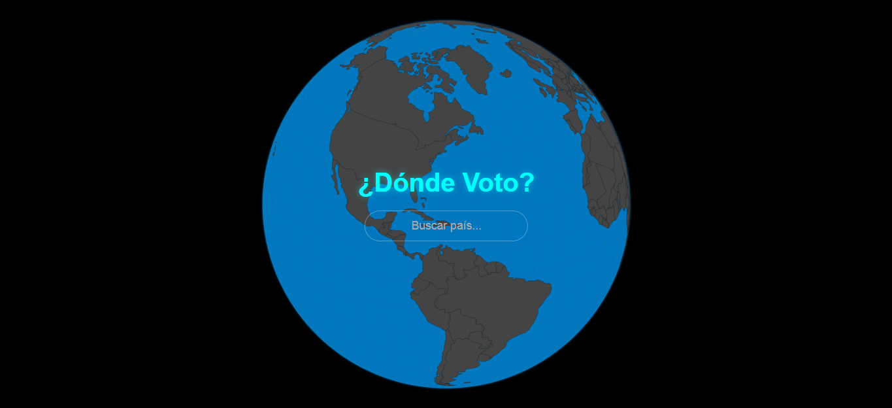
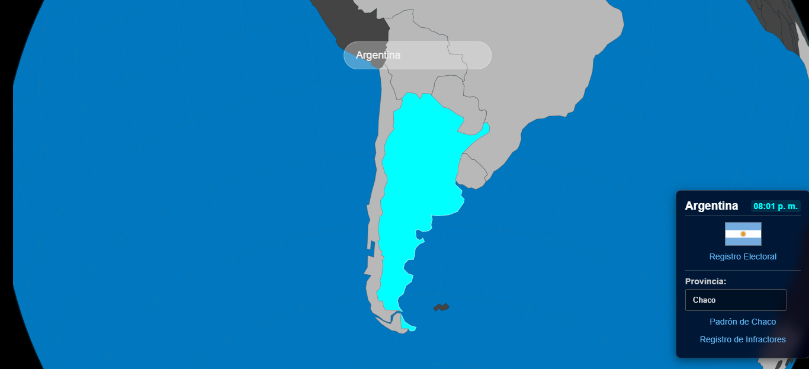
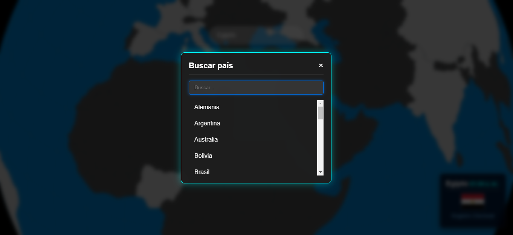

# Consulta Global 🌎

**Consulta Global** es una aplicación que te permite descubrir fácilmente dónde votar y acceder a los enlaces oficiales de registro electoral de diferentes países alrededor del mundo.

## ✨ Características principales

- 🌍 **Globo terráqueo interactivo**: Explora el mundo y selecciona un país para ver su información electoral relevante, su bandera y su hora local actual.
- 📋 **Acceso a enlaces oficiales**: Accede rápidamente a los registros electorales de cada país de manera segura y actualizada.
- 🇦🇷 **Función especializada para Argentina**:
  - Consulta el **padrón electoral** nacional y por **provincia**.
  - Accede al **registro nacional de infractores** de manera sencilla.

## 🚀 Tecnologías utilizadas

- HTML5 / CSS3 / JavaScript
- (Opcional) Three.js para visualización 3D
- APIs de hora mundial y registros electorales oficiales

## 📸 Capturas de pantalla

  

  

